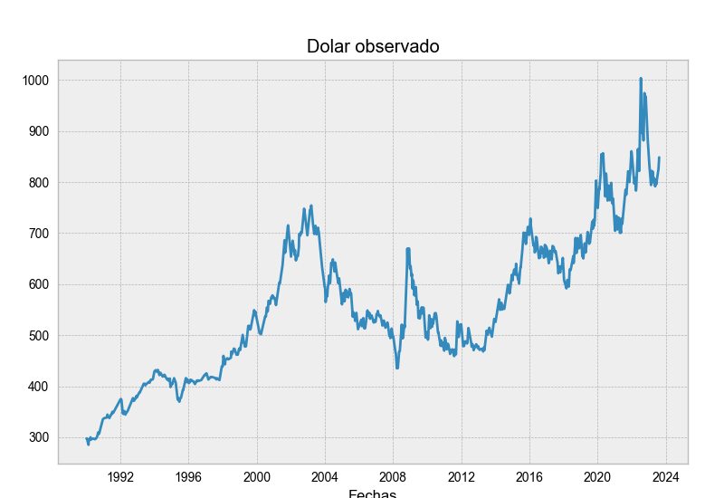
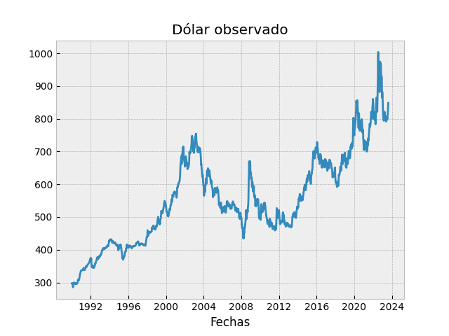
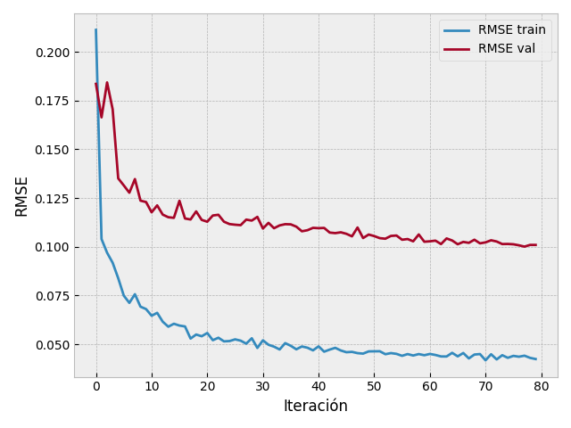
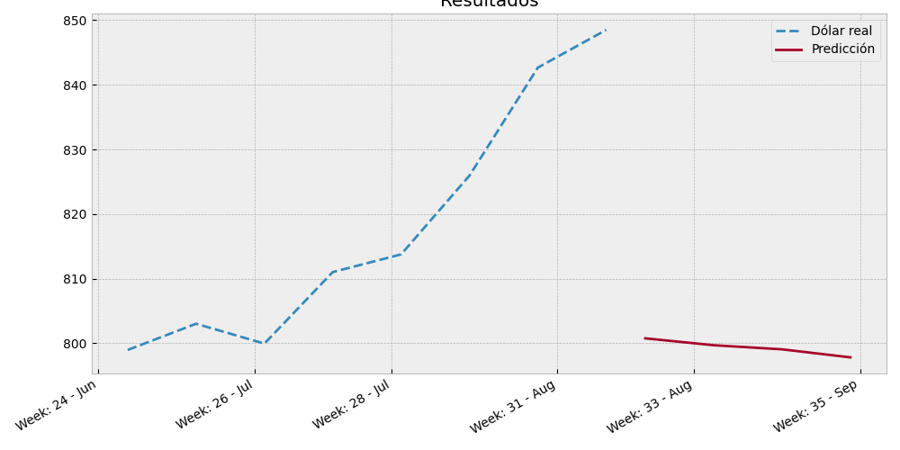

# Prónostico del valor USD/CLP

En este proyecto tiene el objetico de predecir el valor semanal del USD/CLP en base a series de tiempo (Forecasting), así emprendedores y diferentes usuarios pueden tener un estudio de referencia para estimar el comportamiento del dolar en las siguientes semanas. Obviamente este prónostico no asegura que el valor del dolar se comporte según lo predicho.

Este proyecto consta de diferentes partes:

1. Obtener los valores historicos del USD/CLP.
2. Preprocesamiento de los datos.
3. Entrenamiento de red neuronal LSTM.
4. Predicción y reporte.

Estos puntos se desarrollaron en Python usando las librerías:

## Obtener datos historicos

Existen librerias dedicadas al seguimiento de divisas y valores del mercado que funcionan con Python. Sin embargo, no logré encontrar alguna que trabajara con USD/CLP, por lo que sería necesario realizar Scraping desde alguna web que tenga disponible la información.

Como solo se requieren los valores diarios, dado que el pronostico se hará en base al promedio semanal, es que se rescataron desde la página del banco central de Chile. Los datos seleccionados van desde 1990 hasta la fecha y se pueden visualizar en el siguiente gráfico.

## Preprocesamiento de los datos

En cuanto a los puntos que siguen en el proyecto, todos se desarrollaron en wl archivo de "Forecast" y también se explican a mayor profundidad en este.

Los datos recopilados tienen una periodicidad diaria y para el proyecto se requiere el valor semanal. Al procesarlo obtenemos el valor promedio por semana de los datos, como se muestran en el siguiente plot:

De forma paralela se realizó feature engineer sobre los registros de la divisa para obtener los valores semanales de la desviación estandar y un indicador relacionado a la tendencia en alta o baja de la semana. Con estas nuevas variables se entrenó un modelo de forecasting multivariado, que (spoiler) tiene el mismo desempeño que el modelo univariado, esto se desarrollará más adelante. 

## Entrenamiento de la red

El entrenamiento se entrena bajo los parametros de que se ingresan los valores de las últimas 156 semanas (3 años) para predecir los valores de las próximas 4 semanas. En base a esto se espera que el modelo comprenda los patrones entre las divisas. La efectividad del modelo se midió con el indicador 'Raiz del error cuadrático medio', mientras menor sea el valor de RECM (RMSE, por sus siglas en inglés) mejor seran las predicciones del modelo. El siguiente gráfico muestra la comparación del RSME del entrenamiento del modelo, tanto de los datos de entrenamiento como de validación.

Al comparar los indicadores de error de los 3 grupos de datos encontramos que las predicciones del modelo no se ajustan del todo bien a los datos, sobre todo en los datos de validación que corresponden a los últimos 3 años. 

|**Set de datos**|**RMSE**|
|----------------|--------|
|Train|4.1%|
|Validation|9.5%|
|Test|2.2%|

Esto se debe a que los datos en los últimos 4 años son más volatiles dados los problemas y crisis que ha atravesado la economia mundial, ya que si comparamos con los datos de testeo (los primeros 4 años) estos tienen un RMSE menor porque son más constantes.

## Predicción y reporte

A pesar de la falta de precisión del modelo, se predicen los valores de las siguientes 4 semanas. 

Al observar el gráfico de resultados claramente vemos que las predicción siguen una línea de tendencia aproximada a los 800 CLP por cada USD, dejando un valor de diferencia de mas de 40 $. Concluimos que es poco probable que se cumpla con esta predicción y queda en evidencia que el modelo no es asertivo en épocas volátiles como la que estamos atravesando.

Falta por desarrollar:

* Un Dataframe con todos los datos a gráficar en el resultado
* Exportar esos datos a un CSV y luego una hoja de google
* Diseñar un Dashboard en Looker Studio para adjuntarlo en una página de la web Pymetools.